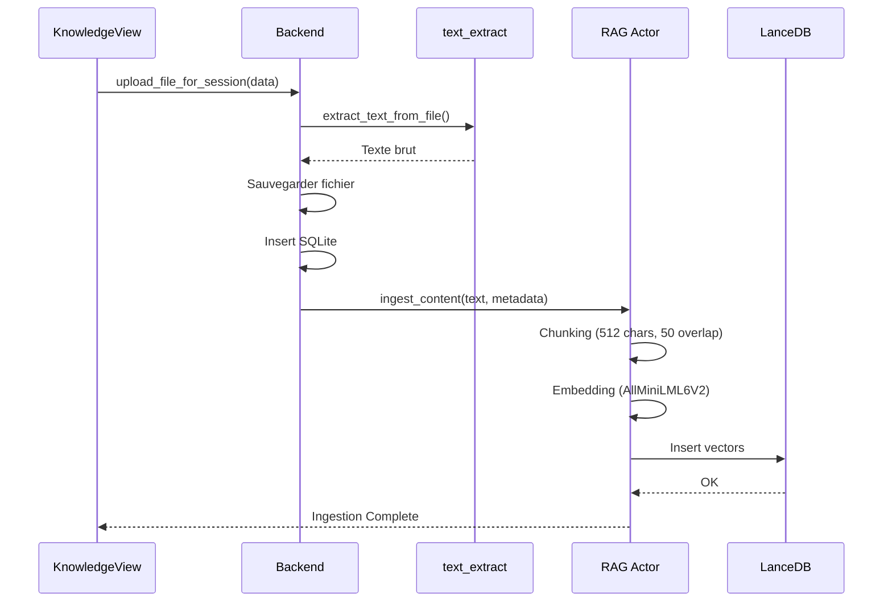
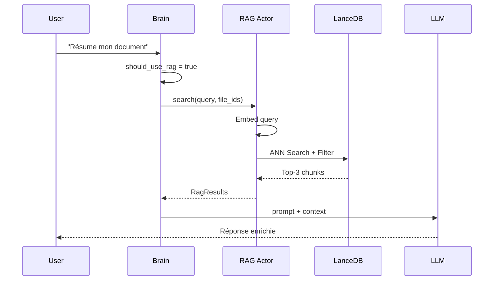

# 📘 WhytChat - Documentation Complète du Système

> Version 1.0 - Novembre 2025

## Table des Matières

1. [Présentation Générale](#1-présentation-générale)
2. [Architecture Technique](#2-architecture-technique)
3. [Installation et Configuration](#3-installation-et-configuration)
4. [Fonctionnalités Complètes](#4-fonctionnalités-complètes)
5. [API Backend (Commandes Tauri)](#5-api-backend-commandes-tauri)
6. [Système RAG (Retrieval-Augmented Generation)](#6-système-rag)
7. [Intelligence Artificielle](#7-intelligence-artificielle)
8. [Interface Utilisateur](#8-interface-utilisateur)
9. [Gestion des Données](#9-gestion-des-données)
10. [Sécurité](#10-sécurité)
11. [Diagnostics et Debugging](#11-diagnostics-et-debugging)
12. [Contribution et Développement](#12-contribution-et-développement)

---

## 1. Présentation Générale

### 1.1 Qu'est-ce que WhytChat ?

WhytChat est une application de chat IA **100% locale et privée** construite avec Tauri, Rust et React. Elle permet de :

- 💬 **Discuter avec une IA** sans connexion Internet (après téléchargement initial)
- 📚 **Enrichir les réponses** avec vos propres documents (RAG)
- 🔒 **Garantir la confidentialité** - aucune donnée ne quitte votre machine
- 🎯 **Personnaliser l'IA** par session (system prompt, température)

### 1.2 Philosophie

```
┌─────────────────────────────────────────────────────────────┐
│  "Votre IA, vos données, votre machine."                   │
│                                                             │
│  • Pas d'API cloud                                          │
│  • Pas de télémétrie                                        │
│  • Portable (fonctionne même sur clé USB)                   │
└─────────────────────────────────────────────────────────────┘
```

### 1.3 Stack Technologique

| Composant            | Technologie               | Rôle                          |
| -------------------- | ------------------------- | ----------------------------- |
| **Backend**          | Rust + Tauri 2.0          | Logique métier, IPC, sécurité |
| **Frontend**         | React 18 + Vite           | Interface utilisateur         |
| **State Management** | Zustand                   | État global persistant        |
| **Base de données**  | SQLite (sqlx)             | Sessions, messages, fichiers  |
| **Vecteurs**         | LanceDB                   | Embeddings pour le RAG        |
| **LLM**              | llama-server (llama.cpp)  | Inférence locale GGUF         |
| **Embeddings**       | fastembed (AllMiniLML6V2) | Vectorisation des documents   |

---

## 2. Architecture Technique

### 2.1 Vue d'Ensemble

```
┌─────────────────────────────────────────────────────────────────────┐
│                        WhytChat Architecture                        │
├─────────────────────────────────────────────────────────────────────┤
│                                                                     │
│  ┌─────────────────────┐         ┌──────────────────────────────┐  │
│  │   FRONTEND (React)  │         │     BACKEND (Rust/Tauri)     │  │
│  │                     │◄───────►│                              │  │
│  │  • App.jsx          │  IPC    │  • main.rs (Entry Point)     │  │
│  │  • Zustand Store    │         │  • AppState (Global)         │  │
│  │  • Components/      │         │  • Actors/ (Tokio)           │  │
│  │  • Views/           │         │  • Brain/ (Intent Analysis)  │  │
│  └─────────────────────┘         └──────────────────────────────┘  │
│                                            │                        │
│                                            ▼                        │
│  ┌─────────────────────┐         ┌──────────────────────────────┐  │
│  │    PERSISTENCE      │         │    EXTERNAL PROCESSES        │  │
│  │                     │         │                              │  │
│  │  • SQLite (Chat)    │         │  • llama-server.exe (LLM)    │  │
│  │  • LanceDB (RAG)    │         │  • HTTP :18080               │  │
│  │  • Files (data/)    │         │                              │  │
│  └─────────────────────┘         └──────────────────────────────┘  │
│                                                                     │
└─────────────────────────────────────────────────────────────────────┘
```

### 2.2 Actor System (Tokio)

Le backend utilise un système d'acteurs asynchrones :

```
                    ┌───────────────────┐
                    │   SUPERVISOR      │
                    │   (Orchestrator)  │
                    └─────────┬─────────┘
                              │
           ┌──────────────────┼──────────────────┐
           │                  │                  │
           ▼                  ▼                  ▼
   ┌───────────────┐  ┌───────────────┐  ┌───────────────┐
   │   LLM ACTOR   │  │   RAG ACTOR   │  │  BRAIN MODULE │
   │               │  │               │  │               │
   │ • HTTP Client │  │ • LanceDB     │  │ • Regex       │
   │ • Streaming   │  │ • FastEmbed   │  │ • Semantic    │
   │ • Token Parse │  │ • Chunking    │  │ • Intent      │
   └───────────────┘  └───────────────┘  └───────────────┘
```

### 2.3 Structure des Fichiers

```
WhytChat_V1/
├── apps/
│   ├── core/                    # Backend Rust
│   │   ├── src/
│   │   │   ├── main.rs          # Entry point + Tauri commands
│   │   │   ├── actors/          # Actor system
│   │   │   │   ├── supervisor.rs
│   │   │   │   ├── llm.rs
│   │   │   │   └── rag.rs
│   │   │   ├── brain/           # Intent analysis
│   │   │   ├── database.rs      # SQLite operations
│   │   │   ├── text_extract.rs  # PDF/DOCX extraction
│   │   │   ├── fs_manager.rs    # Portable paths
│   │   │   └── models.rs        # Data structures
│   │   └── tauri.conf.json
│   │
│   └── desktop-ui/              # Frontend React
│       ├── src/
│       │   ├── App.jsx
│       │   ├── store/appStore.js
│       │   ├── components/
│       │   │   ├── chat/
│       │   │   ├── views/KnowledgeView.jsx
│       │   │   ├── onboarding/
│       │   │   └── layout/
│       │   └── locales/         # i18n (fr, en)
│       └── index.html
│
├── data/                        # Runtime data
│   ├── db/whytchat.sqlite
│   ├── files/                   # Uploaded files
│   ├── models/                  # GGUF + embeddings
│   └── vectors/                 # LanceDB storage
│
├── tools/
│   └── llama/                   # llama-server binaries
│
└── Doc/                         # Documentation
```

---

## 3. Installation et Configuration

### 3.1 Prérequis

| Composant   | Version Minimale | Recommandé                     |
| ----------- | ---------------- | ------------------------------ |
| **Node.js** | 18.0             | 20.x LTS                       |
| **Rust**    | 1.70             | Dernière stable                |
| **RAM**     | 8 GB             | 16 GB                          |
| **Disque**  | 10 GB libre      | 20 GB (pour plusieurs modèles) |
| **OS**      | Windows 10       | Windows 11                     |

### 3.2 Installation

```bash
# 1. Cloner le dépôt
git clone https://github.com/WhytcardAI/WhytChat.git
cd WhytChat_V1

# 2. Installer les dépendances
npm install

# 3. Lancer en mode développement
npm run tauri dev
```

### 3.3 Premier Lancement (Onboarding)

Au premier lancement, l'application :

1. **Vérifie la structure** des dossiers (`data/`, `tools/`)
2. **Télécharge llama-server** (~200 MB)
3. **Télécharge le modèle IA** (Qwen 2.5 7B, ~4.7 GB)
4. **Initialise les embeddings** (AllMiniLML6V2, ~25 MB)

```
┌─────────────────────────────────────────────────────────────┐
│                    ONBOARDING PROGRESS                      │
├─────────────────────────────────────────────────────────────┤
│  [████████████████████████████░░░░░░░░░░░░]  65%            │
│                                                             │
│  ✓ llama-server downloaded                                  │
│  ● Downloading model... (4.7 GB)                            │
│  ○ Initialize embeddings                                    │
└─────────────────────────────────────────────────────────────┘
```

### 3.4 Configuration Avancée

Les variables d'environnement disponibles :

| Variable           | Défaut      | Description                              |
| ------------------ | ----------- | ---------------------------------------- |
| `RUST_LOG`         | `info`      | Niveau de log (debug, info, warn, error) |
| `LLAMA_AUTH_TOKEN` | Auto-généré | Token d'authentification interne         |

---

## 4. Fonctionnalités Complètes

### 4.1 Chat avec l'IA

#### Créer une Session

```javascript
// Via l'interface : Bouton "+ Nouvelle" dans la sidebar
// Via le code :
await invoke("create_session", {
  title: "Ma conversation",
  language: "fr",
  systemPrompt: "Tu es un expert Python.",
  temperature: 0.7,
});
```

#### Options de Session

| Paramètre      | Type         | Description                          |
| -------------- | ------------ | ------------------------------------ |
| `title`        | String       | Nom de la conversation               |
| `language`     | "fr" \| "en" | Langue des réponses                  |
| `systemPrompt` | String       | Instructions pour l'IA               |
| `temperature`  | 0.0 - 2.0    | Créativité (0 = précis, 2 = créatif) |

#### Envoyer un Message

```javascript
await invoke("debug_chat", {
  sessionId: "uuid-de-session",
  message: "Comment créer un serveur Express ?",
});

// L'IA répond en streaming via des events Tauri
window.__TAURI__.event.listen("chat-token", (event) => {
  console.log("Token reçu:", event.payload);
});
```

### 4.2 Base de Connaissances (Knowledge Base)

#### Architecture des Fichiers

```
┌─────────────────────────────────────────────────────────────┐
│                   FILE UPLOAD ARCHITECTURE                   │
├─────────────────────────────────────────────────────────────┤
│                                                             │
│  ┌─────────────────┐                                        │
│  │  KnowledgeView  │ ◄── SEULE ENTRÉE pour fichiers         │
│  │  (Import Data)  │     externes                           │
│  └────────┬────────┘                                        │
│           │                                                 │
│           ▼                                                 │
│  ┌─────────────────┐     ┌─────────────────┐               │
│  │  text_extract   │────►│   RAG Actor     │               │
│  │  PDF/DOCX/TXT   │     │   (LanceDB)     │               │
│  └─────────────────┘     └─────────────────┘               │
│                                   │                         │
│                                   ▼                         │
│  ┌─────────────────┐     ┌─────────────────┐               │
│  │ SessionWizard   │────►│  Liaison seule  │               │
│  │ (Sélection)     │     │  (Pas upload)   │               │
│  └─────────────────┘     └─────────────────┘               │
│                                                             │
│  ┌─────────────────┐                                        │
│  │   ChatInput     │ ◄── Texte UNIQUEMENT                   │
│  │   (No upload)   │                                        │
│  └─────────────────┘                                        │
│                                                             │
└─────────────────────────────────────────────────────────────┘
```

#### Formats Supportés

| Extension        | Crate/Méthode | Taille Max |
| ---------------- | ------------- | ---------- |
| `.txt`           | UTF-8 direct  | 10 MB      |
| `.md`            | UTF-8 direct  | 10 MB      |
| `.csv`           | UTF-8 direct  | 10 MB      |
| `.json`          | UTF-8 direct  | 10 MB      |
| `.pdf`           | `pdf-extract` | 10 MB      |
| `.docx` / `.doc` | `docx-rs`     | 10 MB      |

#### Workflow d'Import

1. **Upload** : Glisser-déposer ou sélection dans KnowledgeView
2. **Extraction** : `text_extract.rs` convertit en texte brut
3. **Stockage** : Fichier sauvé dans `data/files/{uuid}.ext`
4. **Indexation** : Chunking → Embedding → LanceDB

```rust
// Code d'extraction (text_extract.rs)
pub fn extract_text_from_file(filename: &str, data: &[u8]) -> Result<String, String> {
    let extension = get_extension(filename);
    match extension.as_str() {
        "pdf" => extract_pdf_text(data),
        "docx" | "doc" => extract_docx_text(data),
        "txt" | "md" | "csv" | "json" => Ok(String::from_utf8_lossy(data).to_string()),
        _ => Err(format!("Unsupported extension: {}", extension))
    }
}
```

#### Association Fichiers ↔ Sessions

```javascript
// Lier un fichier existant à une session (pas de ré-upload)
await invoke("link_library_file_to_session", {
  sessionId: "session-uuid",
  fileId: "file-uuid",
});
```

### 4.3 Organisation

#### Dossiers

```javascript
// Créer un dossier
await invoke("create_folder", {
  name: "Projets Python",
  color: "#3B82F6",
  folderType: "session", // ou "file"
});

// Déplacer une session
await invoke("move_session_to_folder", {
  sessionId: "...",
  folderId: "...",
});

// Déplacer un fichier
await invoke("move_file_to_folder", {
  fileId: "...",
  folderId: "...",
});
```

#### Favoris

```javascript
// Marquer/démarquer comme favori
const isFavorite = await invoke("toggle_session_favorite", {
  sessionId: "...",
});
```

### 4.4 Thèmes

L'application supporte les thèmes clair et sombre :

```javascript
// Dans appStore.js
toggleTheme: () => {
  const newTheme = state.theme === "light" ? "dark" : "light";
  document.documentElement.classList.toggle("dark");
  set({ theme: newTheme });
};
```

---

## 5. API Backend (Commandes Tauri)

### 5.1 Référence Complète

#### Initialisation

| Commande                    | Paramètres | Retour            | Description                         |
| --------------------------- | ---------- | ----------------- | ----------------------------------- |
| `initialize_app`            | -          | `()`              | Initialise le backend               |
| `check_model_exists`        | -          | `bool`            | Vérifie si le modèle est téléchargé |
| `run_quick_preflight_check` | -          | `PreflightReport` | Check rapide de l'état              |
| `download_model`            | -          | `()`              | Télécharge modèle + llama-server    |

#### Sessions

| Commande                  | Paramètres                                            | Retour         | Description               |
| ------------------------- | ----------------------------------------------------- | -------------- | ------------------------- |
| `create_session`          | `title`, `language?`, `systemPrompt?`, `temperature?` | `String` (ID)  | Crée une session          |
| `list_sessions`           | -                                                     | `Vec<Session>` | Liste toutes les sessions |
| `get_session_messages`    | `sessionId`                                           | `Vec<Message>` | Messages d'une session    |
| `update_session`          | `sessionId`, `title?`, `modelConfig?`                 | `()`           | Met à jour une session    |
| `delete_session`          | `sessionId`                                           | `()`           | Supprime une session      |
| `toggle_session_favorite` | `sessionId`                                           | `bool`         | Bascule favori            |

#### Chat

| Commande     | Paramètres             | Retour   | Description       |
| ------------ | ---------------------- | -------- | ----------------- |
| `debug_chat` | `sessionId`, `message` | `String` | Envoie un message |

_Note: Les tokens sont envoyés via l'event `chat-token`_

#### Fichiers

| Commande                       | Paramètres                          | Retour             | Description                  |
| ------------------------------ | ----------------------------------- | ------------------ | ---------------------------- |
| `upload_file_for_session`      | `sessionId`, `fileName`, `fileData` | `String` (ID)      | Upload + ingestion           |
| `link_library_file_to_session` | `sessionId`, `fileId`               | `()`               | Lie un fichier existant      |
| `list_library_files`           | -                                   | `Vec<LibraryFile>` | Liste tous les fichiers      |
| `get_session_files`            | `sessionId`                         | `Vec<SessionFile>` | Fichiers d'une session       |
| `delete_file`                  | `fileId`                            | `()`               | Supprime un fichier          |
| `reindex_library`              | -                                   | `String`           | Réindexe tous les fichiers   |
| `save_generated_file`          | `sessionId`, `fileName`, `content`  | `String` (ID)      | Sauvegarde du contenu généré |

#### Dossiers

| Commande                 | Paramètres                      | Retour        | Description             |
| ------------------------ | ------------------------------- | ------------- | ----------------------- |
| `create_folder`          | `name`, `color?`, `folderType?` | `Folder`      | Crée un dossier         |
| `list_folders`           | -                               | `Vec<Folder>` | Liste tous les dossiers |
| `delete_folder`          | `folderId`                      | `()`          | Supprime un dossier     |
| `move_session_to_folder` | `sessionId`, `folderId?`        | `()`          | Déplace une session     |
| `move_file_to_folder`    | `fileId`, `folderId?`           | `()`          | Déplace un fichier      |

#### Diagnostics

| Commande                  | Paramètres | Retour            | Description     |
| ------------------------- | ---------- | ----------------- | --------------- |
| `run_diagnostic_category` | `category` | `Vec<TestResult>` | Lance des tests |

### 5.2 Structures de Données

```rust
// Session
pub struct Session {
    pub id: String,
    pub title: String,
    pub model_config: ModelConfig,
    pub is_favorite: bool,
    pub folder_id: Option<String>,
    pub created_at: DateTime<Utc>,
    pub updated_at: DateTime<Utc>,
}

// Message
pub struct Message {
    pub id: String,
    pub session_id: String,
    pub role: String,        // "user" | "assistant"
    pub content: String,
    pub created_at: DateTime<Utc>,
}

// LibraryFile
pub struct LibraryFile {
    pub id: String,
    pub name: String,
    pub path: String,
    pub file_type: String,
    pub size: i64,
    pub folder_id: Option<String>,
    pub created_at: DateTime<Utc>,
}

// ModelConfig
pub struct ModelConfig {
    pub model_id: String,
    pub temperature: f32,
    pub system_prompt: String,
}
```

---

## 6. Système RAG

### 6.1 Vue d'Ensemble

Le RAG (Retrieval-Augmented Generation) permet à l'IA d'accéder à vos documents :

```
┌─────────────┐     ┌─────────────┐     ┌─────────────┐
│  Question   │────►│  Embedding  │────►│   Search    │
│  Utilisateur│     │  (384-dim)  │     │  (LanceDB)  │
└─────────────┘     └─────────────┘     └──────┬──────┘
                                               │
                                               ▼
┌─────────────┐     ┌─────────────┐     ┌─────────────┐
│  Réponse    │◄────│    LLM      │◄────│  Top-3      │
│  Enrichie   │     │  (Qwen)     │     │  Chunks     │
└─────────────┘     └─────────────┘     └─────────────┘
```

### 6.2 Workflow d'Ingestion



### 6.3 Workflow de Recherche



### 6.4 Schéma LanceDB

```
Table: knowledge_base
┌──────────┬──────────────────────┬─────────────────────────────────┐
│ id (Utf8)│ content (Utf8)       │ metadata (Utf8)                 │
├──────────┼──────────────────────┼─────────────────────────────────┤
│ uuid-1   │ "Premier paragraphe" │ "file:abc-123"                  │
│ uuid-2   │ "Deuxième partie..." │ "file:abc-123"                  │
│ uuid-3   │ "Autre document..."  │ "file:def-456"                  │
└──────────┴──────────────────────┴─────────────────────────────────┘

+ vector: FixedSizeList<f32>[384]
```

### 6.5 Isolation par Session

Chaque session ne voit que les fichiers qui lui sont liés :

```sql
-- Table de liaison
CREATE TABLE session_files_link (
    session_id TEXT NOT NULL,
    file_id TEXT NOT NULL,
    PRIMARY KEY (session_id, file_id)
);
```

```rust
// Filtre RAG
let filter = file_ids.iter()
    .map(|id| format!("metadata = 'file:{}'", id))
    .collect::<Vec<_>>()
    .join(" OR ");
```

---

## 7. Intelligence Artificielle

### 7.1 Architecture LLM

```
┌─────────────────────────────────────────────────────────────┐
│                     LLM ARCHITECTURE                        │
├─────────────────────────────────────────────────────────────┤
│                                                             │
│  ┌─────────────────┐     ┌─────────────────┐               │
│  │   Rust Backend  │     │  llama-server   │               │
│  │                 │────►│   (Subprocess)  │               │
│  │  HTTP Client    │ SSE │                 │               │
│  └─────────────────┘◄────│  Port: 18080    │               │
│                          └────────┬────────┘               │
│                                   │                         │
│                          ┌────────▼────────┐               │
│                          │    GGUF Model   │               │
│                          │ Qwen 2.5 7B Q4  │               │
│                          │   (~4.7 GB)     │               │
│                          └─────────────────┘               │
│                                                             │
└─────────────────────────────────────────────────────────────┘
```

### 7.2 Modèle par Défaut

| Propriété        | Valeur                     |
| ---------------- | -------------------------- |
| **Nom**          | Qwen 2.5 Coder 7B Instruct |
| **Quantization** | Q4_K_M                     |
| **Taille**       | ~4.7 GB                    |
| **Contexte**     | 8192 tokens                |
| **Langues**      | Français, Anglais, Code    |

### 7.3 Module Brain

Le "Brain" analyse les requêtes avant le LLM :

```
┌─────────────┐
│   Input     │
└──────┬──────┘
       │
       ▼
┌──────────────┐     Match?      ┌─────────────────┐
│    REGEX     │─────────────────►│   Fast Path    │
│   Patterns   │     YES (~1ms)  │  Intent Found   │
└──────┬───────┘                 └─────────────────┘
       │ NO
       ▼
┌──────────────┐                 ┌─────────────────┐
│   SEMANTIC   │─────────────────►│  Semantic Path │
│  Embeddings  │    (~50ms)      │  Intent Found   │
└──────────────┘                 └─────────────────┘
```

#### Intents Détectés

| Intent        | Exemples                                  | Action          |
| ------------- | ----------------------------------------- | --------------- |
| `Greeting`    | "Bonjour", "Salut"                        | Réponse rapide  |
| `CodeRequest` | "Code moi...", "Écris un script"          | Mode code       |
| `Question`    | "Pourquoi ?", "Comment ?"                 | Mode explicatif |
| `Translation` | "Traduis en..."                           | Mode traduction |
| `RAG`         | "Dans mon document", "Selon mes fichiers" | Activation RAG  |

### 7.4 Embeddings

| Propriété      | Valeur        |
| -------------- | ------------- |
| **Modèle**     | AllMiniLML6V2 |
| **Dimensions** | 384           |
| **Taille**     | ~23 MB        |
| **Runtime**    | ONNX (CPU)    |

```rust
// Exemple d'utilisation
let model = TextEmbedding::try_new(
    InitOptions::new(EmbeddingModel::AllMiniLML6V2)
)?;

let vectors = model.embed(
    vec!["Texte à vectoriser"],
    None
)?;
// vectors[0] = [0.123, -0.456, ...] (384 floats)
```

---

## 8. Interface Utilisateur

### 8.1 Composants Principaux

```
┌─────────────────────────────────────────────────────────────────┐
│                         WHYTCHAT UI                             │
├─────────────────────────────────────────────────────────────────┤
│ ┌─────────┬─────────────────────────────────────┬────────────┐  │
│ │         │                                     │            │  │
│ │ SIDEBAR │           MAIN CONTENT              │            │  │
│ │         │                                     │            │  │
│ │ Sessions│  ┌─────────────────────────────┐   │            │  │
│ │ Folders │  │                             │   │            │  │
│ │         │  │   KnowledgeView             │   │            │  │
│ │ ──────  │  │     OR                      │   │            │  │
│ │         │  │   ChatView                  │   │            │  │
│ │ Actions │  │                             │   │            │  │
│ │         │  │                             │   │            │  │
│ │         │  └─────────────────────────────┘   │            │  │
│ │         │                                     │            │  │
│ └─────────┴─────────────────────────────────────┴────────────┘  │
│                                                                 │
│ ┌─────────────────────────────────────────────────────────────┐ │
│ │                      BOTTOM BAR                             │ │
│ │  Theme Toggle | Diagnostics | Settings                      │ │
│ └─────────────────────────────────────────────────────────────┘ │
└─────────────────────────────────────────────────────────────────┘
```

### 8.2 Vues

#### KnowledgeView

- Import de fichiers (drag & drop, multi-sélection)
- Organisation en dossiers
- Actions rapides (analyse, suppression, déplacement)

#### ChatView

- Messages en temps réel (streaming)
- Indicateur de "thinking"
- Historique scrollable

#### SessionWizard

- Création guidée de session
- Sélection de fichiers existants
- Configuration avancée (prompt, température)

### 8.3 État Global (Zustand)

```javascript
// Structure du store
{
  // UI
  currentView: 'knowledge' | 'chat',
  isSidebarOpen: boolean,
  theme: 'light' | 'dark',

  // Session
  sessions: Session[],
  currentSessionId: string | null,
  sessionFiles: SessionFile[],

  // Library
  libraryFiles: LibraryFile[],
  folders: Folder[],

  // Backend
  isBackendInitialized: boolean,
  isConfigured: boolean,

  // Actions
  loadSessions: () => Promise<void>,
  createSession: (title, ...) => Promise<string>,
  uploadFile: (sessionId, file) => Promise<void>,
  // ...
}
```

### 8.4 Internationalisation (i18n)

Langues supportées : **Français**, **Anglais**

```javascript
// apps/desktop-ui/src/locales/fr/common.json
{
  "sidebar": {
    "newSession": "Nouvelle session",
    "favorites": "Favoris",
    "folders": "Dossiers"
  },
  "chat": {
    "placeholder": "Écrivez votre message...",
    "thinking": "Réflexion en cours..."
  }
}
```

---

## 9. Gestion des Données

### 9.1 PortablePathManager

Tous les chemins sont résolus dynamiquement pour la portabilité :

```rust
pub struct PortablePathManager;

impl PortablePathManager {
    pub fn data_dir() -> PathBuf { ... }     // data/
    pub fn models_dir() -> PathBuf { ... }   // data/models/
    pub fn files_dir() -> PathBuf { ... }    // data/files/
    pub fn vectors_dir() -> PathBuf { ... }  // data/vectors/
    pub fn tools_dir() -> PathBuf { ... }    // tools/
}
```

### 9.2 Schéma SQLite

```sql
-- Sessions
CREATE TABLE sessions (
    id TEXT PRIMARY KEY,
    title TEXT NOT NULL,
    model_config TEXT NOT NULL,  -- JSON
    is_favorite INTEGER DEFAULT 0,
    folder_id TEXT,
    created_at TEXT NOT NULL,
    updated_at TEXT NOT NULL
);

-- Messages
CREATE TABLE messages (
    id TEXT PRIMARY KEY,
    session_id TEXT NOT NULL,
    role TEXT NOT NULL,
    content TEXT NOT NULL,
    created_at TEXT NOT NULL,
    FOREIGN KEY (session_id) REFERENCES sessions(id)
);

-- Library Files
CREATE TABLE library_files (
    id TEXT PRIMARY KEY,
    name TEXT NOT NULL,
    path TEXT NOT NULL,
    file_type TEXT NOT NULL,
    size INTEGER NOT NULL,
    folder_id TEXT,
    created_at TEXT NOT NULL
);

-- Session-File Links
CREATE TABLE session_files_link (
    session_id TEXT NOT NULL,
    file_id TEXT NOT NULL,
    linked_at TEXT NOT NULL,
    PRIMARY KEY (session_id, file_id)
);

-- Folders
CREATE TABLE folders (
    id TEXT PRIMARY KEY,
    name TEXT NOT NULL,
    color TEXT,
    folder_type TEXT DEFAULT 'session',
    created_at TEXT NOT NULL
);
```

### 9.3 Backup et Restauration

```bash
# Backup
cp -r data/ backup/data_$(date +%Y%m%d)/

# Restauration
cp -r backup/data_20251126/ data/
```

---

## 10. Sécurité

### 10.1 Principes

1. **Exécution Locale** : Aucune donnée ne quitte la machine
2. **Isolation** : Le LLM tourne dans un processus séparé
3. **Chiffrement** : Configurations sensibles chiffrées (AES-256-GCM)
4. **Rate Limiting** : Protection contre le spam (20 req/min/session)

### 10.2 Encryption Module

```rust
// apps/core/src/encryption.rs
pub fn encrypt(data: &[u8], key: &[u8; 32]) -> Result<Vec<u8>, Error>;
pub fn decrypt(encrypted: &[u8], key: &[u8; 32]) -> Result<Vec<u8>, Error>;
```

### 10.3 Rate Limiter

```rust
// apps/core/src/rate_limiter.rs
pub struct RateLimiter {
    max_requests: usize,     // 20
    window: Duration,        // 60 seconds
    requests: HashMap<String, Vec<Instant>>,
}
```

---

## 11. Diagnostics et Debugging

### 11.1 Panel de Diagnostics

Accessible via l'icône ⚙️ dans l'interface :

```
┌─────────────────────────────────────────────────────────────┐
│                   SYSTEM DIAGNOSTICS                        │
├─────────────────────────────────────────────────────────────┤
│                                                             │
│  [System]                                                   │
│  ✓ Database connection          12ms                        │
│  ✓ File system writable         3ms                         │
│  ✓ Model file exists            1ms                         │
│                                                             │
│  [LLM]                                                      │
│  ✓ llama-server reachable       45ms                        │
│  ✓ Generation test              892ms                       │
│                                                             │
│  [RAG]                                                      │
│  ✓ LanceDB connection           23ms                        │
│  ✓ Embedding model              156ms                       │
│  ✓ Search test                  78ms                        │
│                                                             │
│  [Simulate Crash]  [Run All Tests]                          │
│                                                             │
└─────────────────────────────────────────────────────────────┘
```

### 11.2 Logging

Les logs sont structurés en JSON (Bunyan format) :

```bash
# Voir les logs en développement
npm run tauri dev

# Filtrer par niveau
RUST_LOG=debug npm run tauri dev
RUST_LOG=whytchat_core=trace npm run tauri dev
```

### 11.3 Tests

```bash
# Tests Rust (unitaires)
cd apps/core && cargo test

# Tests E2E (Playwright)
npm run test:e2e

# Tests d'intégration
node apps/desktop-ui/tests/integration-test.cjs
```

---

## 12. Contribution et Développement

### 12.1 Workflow Git

```
main (stable)
 └── develop (integration)
      ├── feature/xxx
      ├── fix/yyy
      └── refactor/zzz
```

### 12.2 Conventions de Code

#### Rust

```rust
// PascalCase pour les types
pub struct MessageStruct { ... }

// snake_case pour les fonctions/variables
fn process_message(user_input: &str) -> Result<String, Error> { ... }

// SCREAMING_SNAKE pour les constantes
const MAX_FILE_SIZE: usize = 10 * 1024 * 1024;
```

#### JavaScript

```javascript
// camelCase pour les variables/fonctions
const sessionId = "...";
function handleClick() { ... }

// PascalCase pour les composants
function ChatInput({ onSubmit }) { ... }
```

### 12.3 Commandes Utiles

```bash
# Développement
npm run tauri dev

# Build production
npm run tauri build

# Linting
npm run lint

# Formatage
npm run format

# Tests
cargo test
npm run test:e2e
```

### 12.4 Debugging

```bash
# Rust avec backtrace
RUST_BACKTRACE=1 npm run tauri dev

# React DevTools
npm install -g react-devtools
react-devtools

# Tauri DevTools
# Ctrl+Shift+I dans l'application
```

---

## Annexes

### A. Glossaire

| Terme         | Définition                                       |
| ------------- | ------------------------------------------------ |
| **Actor**     | Unité de concurrence qui communique par messages |
| **Chunk**     | Fragment de texte pour le RAG (~512 caractères)  |
| **Embedding** | Représentation vectorielle d'un texte            |
| **GGUF**      | Format de modèle pour llama.cpp                  |
| **IPC**       | Inter-Process Communication (Tauri)              |
| **RAG**       | Retrieval-Augmented Generation                   |
| **SSE**       | Server-Sent Events (streaming)                   |

### B. Dépannage

| Problème                    | Solution                                               |
| --------------------------- | ------------------------------------------------------ |
| Modèle incomplet            | Supprimer `data/models/default-model.gguf` et relancer |
| llama-server ne démarre pas | Vérifier `tools/llama/llama-server.exe`                |
| Erreur "not initialized"    | Attendre la fin du démarrage ou relancer               |
| RAG ne trouve rien          | Vérifier que les fichiers sont liés à la session       |

### C. Ressources

- [Tauri 2.0 Documentation](https://v2.tauri.app/)
- [llama.cpp GitHub](https://github.com/ggml-org/llama.cpp)
- [LanceDB Documentation](https://lancedb.github.io/lancedb/)
- [FastEmbed GitHub](https://github.com/Anush008/fastembed-rs)

---

> **WhytChat V1** - Votre IA locale et privée
> Dernière mise à jour : Novembre 2025
