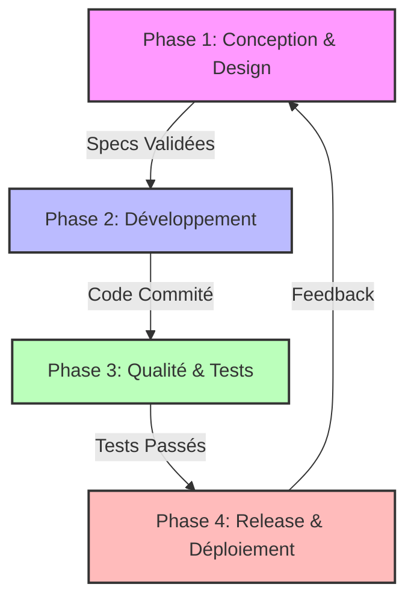

# 🛠️ WhytChat - Guide Méthodologique de Développement (SDLC)

Ce document est le **Manuel du Développeur** officiel de WhytChat. Il définit le Cycle de Vie de Développement Logiciel (SDLC) à suivre pour garantir la qualité, la maintenabilité et la robustesse du projet.

---

## 🔄 1. Cycle de Vie (Vue d'ensemble)

Pour éviter le "Spaghetti Code" et assurer une évolution saine du monorepo (Rust + React), nous suivons un processus strict en 4 phases.

**Pourquoi cet ordre ?**
*   **Conception avant Code** : Coder sans plan mène à des refontes coûteuses.
*   **Tests avant Merge** : Un bug détecté en local coûte 10x moins cher qu'en production.
*   **Linting Obligatoire** : Assure que tout le code respecte les mêmes standards, quel que soit l'auteur.



---

## 🎨 2. Phase 1 : Conception & Design

**Avant d'écrire la moindre ligne de code**, il faut définir *quoi* et *comment*.

### 2.1. Spécification Technique
Pour toute nouvelle fonctionnalité complexe (ex: "Ajout d'un nouvel agent IA"), créez un document court ou une issue détaillée répondant à :
*   **Objectif** : Que fait la feature ?
*   **Entrées/Sorties** : Quelles données entrent ? Qu'est-ce qui sort ?
*   **Impact** : Quels modules existants seront touchés ?

### 2.2. Maquettage UI/UX (Frontend)
Ne jamais coder le CSS "à l'aveugle".
*   Utilisez Figma ou des croquis papier pour valider l'interface.
*   Pensez aux états : Chargement, Erreur, Succès, Vide.

### 2.3. Architecture des Acteurs (Backend Rust)
Le backend n'est pas MVC, c'est un système d'acteurs. Posez-vous les questions :
*   Quel **Acteur** (`Supervisor`, `LLM`, `RAG`) est responsable ?
*   Faut-il créer un nouveau message inter-acteurs ?
*   Comment la donnée persiste-t-elle (SQLite) ?

---

## 💻 3. Phase 2 : Développement (Workflow)

### 3.1. Règles Git
*   **Branche principale** : `main` (Production-ready).
*   **Branches de feature** : `feature/nom-de-la-feature` (ex: `feature/vector-store`).
*   **Branches de fix** : `fix/description-bug` (ex: `fix/memory-leak-rag`).

**Conventions de Commit (Conventional Commits)** :
*   `feat:` : Nouvelle fonctionnalité.
*   `fix:` : Correction de bug.
*   `docs:` : Documentation uniquement.
*   `refactor:` : Modification du code sans changement de fonctionnalité.
*   `chore:` : Maintenance (dépendances, outils).

### 3.2. Philosophie "Local First"
Vous devez pouvoir builder et lancer l'application entièrement sur votre machine sans dépendance externe cachée.
*   **Commande de dev** : `npm run tauri dev` (lance Backend + Frontend).
*   **Si ça ne marche pas chez vous, ça ne marchera pas ailleurs.**

### 3.3. Gestion des Dépendances
*   **Rust (`apps/core/Cargo.toml`)** : Ajoutez uniquement des crates stables et maintenues. Évitez les dépendances trop lourdes si une alternative légère existe.
*   **Node (`package.json`)** : Préférez les paquets légers. Vérifiez toujours la taille du bundle après ajout.

---

## 🛡️ 4. Phase 3 : Qualité & Tests

Cette phase est **bloquante**. Une PR ne doit pas être mergée si cette phase échoue.

### 4.1. Linting & Formatage (Automatisé)
Utilisez les commandes racines pour vérifier tout le projet :
*   **Vérifier la qualité** : `npm run lint`
    *   Exécute `eslint` pour le JS/React.
    *   Exécute `cargo clippy` pour le Rust (capture les erreurs courantes et les problèmes de performance).
*   **Formater le code** : `npm run format`
    *   Applique `prettier` et `cargo fmt`.

### 4.2. Tests Backend (Rust)
*   **Tests Unitaires** : Placez les tests dans le même fichier que le code, sous un module `#[cfg(test)]`.
    ```rust
    #[cfg(test)]
    mod tests {
        use super::*;
        #[test]
        fn test_calcul_complexe() {
            assert_eq!(calcul(2, 2), 4);
        }
    }
    ```
*   **Mocks** : Pour tester un acteur sans lancer tout le système, utilisez des traits ou des bibliothèques comme `mockall` si nécessaire, mais préférez souvent des tests d'intégration légers pour les acteurs.
*   **Lancer les tests** : `cargo test` (depuis la racine ou `apps/core`).

### 4.3. Tests Frontend (React)
*   **Tests E2E (Playwright)** : Les tests critiques (parcours utilisateur complet) sont dans `apps/desktop-ui/tests/`.
    *   Lancer : `npm run test:e2e` (voir `package.json` dans `apps/desktop-ui`).
*   **Tests de Composants** : Vérifiez qu'un composant rend correctement ses props et gère ses événements.

---

## 📦 5. Phase 4 : Release & Maintenance

### 5.1. Versioning Sémantique (SemVer)
Nous suivons `Major.Minor.Patch` (ex: `1.0.0`).
*   **Major** : Changement cassant (incompatible).
*   **Minor** : Nouvelle fonctionnalité (rétro-compatible).
*   **Patch** : Correction de bug (rétro-compatible).

### 5.2. Documentation du Code
*   **Rust** : Utilisez `///` pour documenter les fonctions et structures publiques.
    ```rust
    /// Analyse l'intention de l'utilisateur à partir du texte brut.
    /// Retourne un `SemanticIntent`.
    pub fn analyze(text: &str) -> SemanticIntent { ... }
    ```
*   **JS/React** : JSDoc est apprécié pour les fonctions utilitaires complexes (`libs/utils.js`).

---

*Document maintenu par l'équipe Architecture. Dernière mise à jour : Novembre 2025.*