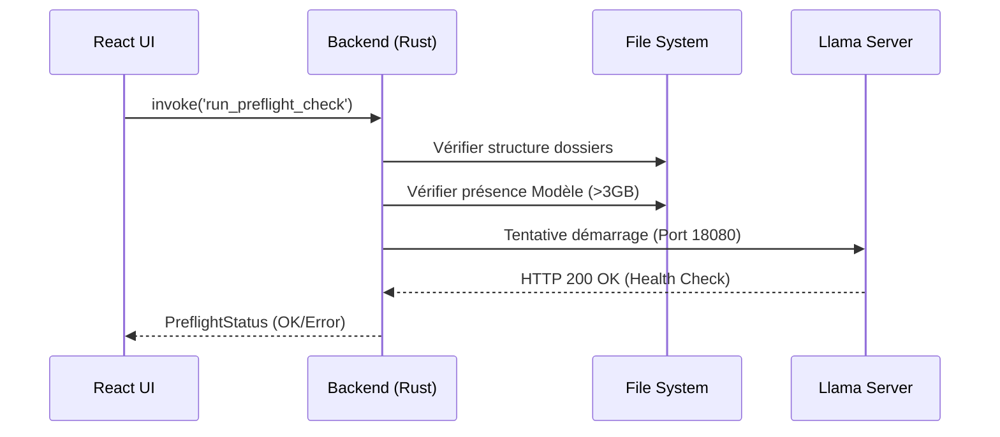
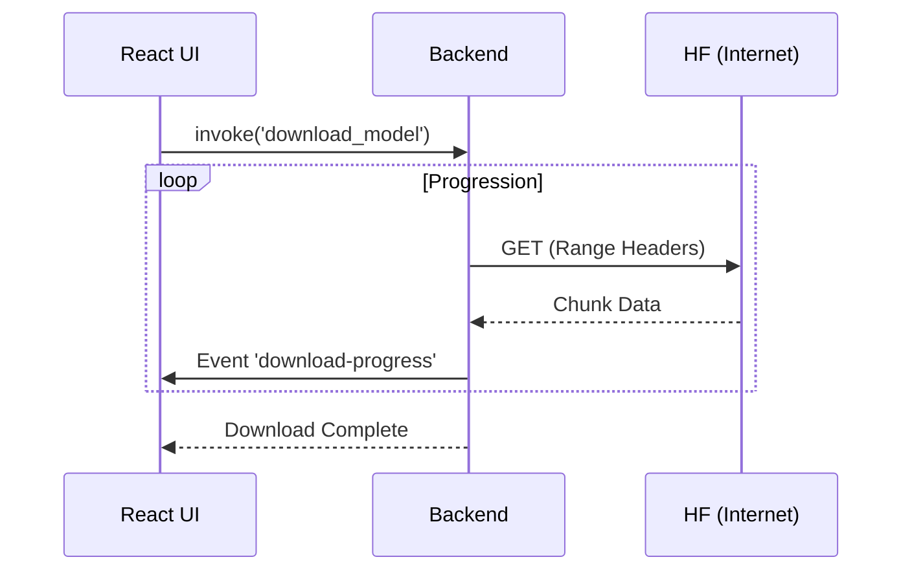
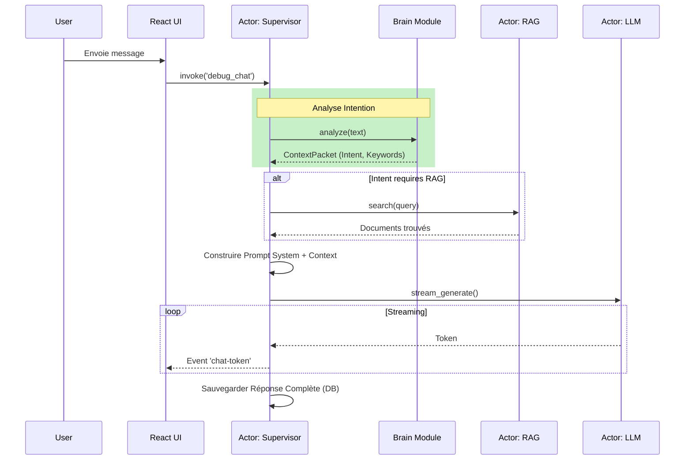
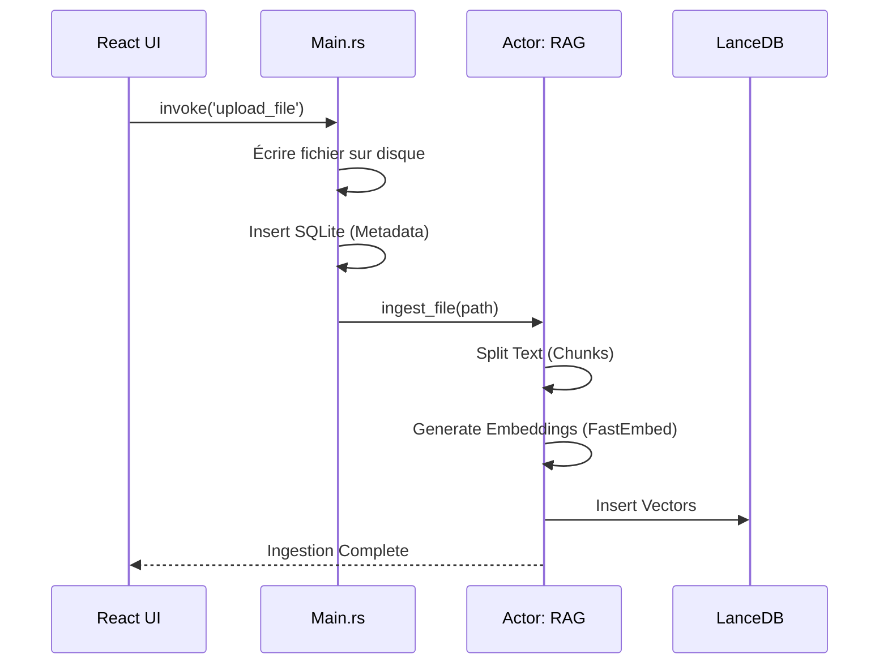

# ⚙️ Processus et Flux Métier

Ce document détaille les workflows critiques de l'application, du démarrage à l'interaction utilisateur.

## 1. Démarrage & Preflight (Bootstrap)

Avant que l'utilisateur puisse voir l'interface principale, une série de vérifications est effectuée.

## 2. Onboarding (Installation Modèle)

Si le Preflight échoue (modèle manquant), l'utilisateur est redirigé vers l'assistant d'onboarding.

## 3. Workflow de Conversation (Chat)

Le cœur de l'application.

## 4. Ingestion de Documents (RAG)

Import de fichiers pour enrichir la base de connaissances.

## 5. Inférence LLM (Détail Technique)

Comment le backend Rust communique avec le processus `llama-server`.

1.  **Rust** envoie une requête HTTP POST à `http://127.0.0.1:8080/completion`.
2.  **Payload JSON** contient le prompt, la température, `stream: true`.
3.  **Llama-server** répond en SSE (Server-Sent Events).
4.  **Rust** lit le flux ligne par ligne, parse `data: {...}` et extrait le champ `content`.

## 6. Diagnostics

Le module de diagnostics permet de tester la chaîne entière sans interaction utilisateur manuelle.

*   **Test RAG** : Crée un fichier temporaire, l'ingère, fait une recherche, vérifie le résultat, nettoie.
*   **Test LLM** : Envoie un prompt simple ("Say hello") et chronomètre la réponse.

---
*Dernière mise à jour : Novembre 2025*