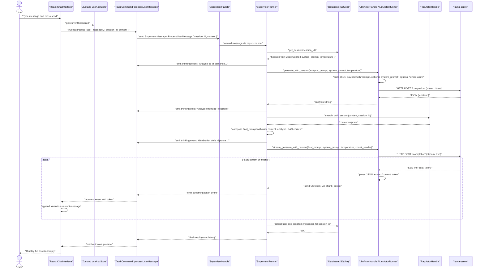
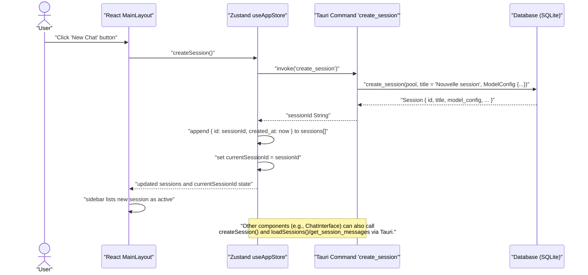

# 🗂️ Architecture Interactive WhytChat - Présentation Technique

## 🎯 Vue d'ensemble

WhytChat est une application de chat IA locale et privée construite avec **Tauri + Rust + React**. Cette présentation explore l'architecture technique à travers des diagrammes interactifs Mermaid.

---

## 🔄 1. Traitement Complet d'une Requête Chat

### Description

Ce diagramme montre le flux complet d'une requête utilisateur dans le système WhytChat, de l'interface React jusqu'à la génération de réponse avec streaming temps réel.

### Points Clés

- ✅ **Sessions persistées** : Chaque conversation a sa propre configuration
- ✅ **Configuration dynamique** : `system_prompt` et `temperature` par session
- ✅ **Multi-agent orchestration** : Analyse → RAG → Génération
- ✅ **Streaming temps réel** : Tokens envoyés au frontend via Tauri events
- ✅ **Persistance complète** : Historique et messages sauvegardés

### Diagramme de Séquence - Traitement Chat



### Explication Détaillée

1. **Trigger UI** : L'utilisateur tape un message et appuie sur "Envoyer"
2. **State Management** : Récupération de l'ID de session courante depuis Zustand
3. **Tauri Bridge** : Invocation de la commande Rust `process_user_message`
4. **Supervisor** : Routage vers le SupervisorHandle qui forward via channel
5. **Configuration Session** : Récupération de la `ModelConfig` depuis SQLite
6. **Analyse** : Génération d'une analyse courte avec les paramètres de session
7. **RAG Search** : Recherche documentaire dans les fichiers de la session
8. **Composition** : Construction du prompt final avec contexte
9. **Génération** : Génération streaming avec paramètres de session
10. **Persistance** : Sauvegarde des messages en base

---

## ➕ 2. Création d'une Nouvelle Session

### Description

Processus de création d'une nouvelle session de chat avec configuration par défaut et persistance en base de données.

### Configuration par Défaut

```json
ModelConfig {
  "model_id": "qwen2.5-7b-instruct-q4_k_m.gguf",
  "temperature": 0.7,
  "system_prompt": "You are a helpful AI assistant."
}
```

### Diagramme de Séquence - Création Session



### Étapes du Processus

1. **Trigger UI** : Clic sur "New Chat" dans la sidebar
2. **Store Action** : Appel de `createSession()` dans le store Zustand
3. **Tauri Command** : Invocation de la commande Rust `create_session`
4. **Database** : Création de la session avec configuration par défaut
5. **State Update** : Mise à jour du state avec la nouvelle session
6. **UI Update** : Sidebar affiche la nouvelle session comme active

### Points d'Extension

- 🔧 **Configuration personnalisable** : Interface pour modifier system_prompt et temperature
- 📝 **Titres dynamiques** : Génération automatique basée sur le premier message
- 🏷️ **Catégorisation** : Tags et catégories pour organiser les sessions
- 🔄 **Templates** : Sessions pré-configurées pour différents cas d'usage

---

## 🏗️ 3. Architecture des Acteurs

### Description

Relations et structure des acteurs du système multi-agent : Supervisor, LLM et RAG.

### Avantages de l'Architecture

- 🔄 **Isolation** : Chaque actor fonctionne indépendamment
- 📈 **Extensibilité** : Nouveaux actors faciles à ajouter
- 🛡️ **Résilience** : Un actor qui crash n'affecte pas les autres
- ⚡ **Performance** : Traitement asynchrone et parallélisation
- 🔧 **Maintenabilité** : Code modulaire et testable

### Diagramme de Classes - Acteurs

```mermaid
classDiagram
    class SupervisorHandle {
        +sender: mpsc::Sender~SupervisorMessage~
        +new() SupervisorHandle
        +new_with_pool(db_pool: Option~SqlitePool~) SupervisorHandle
        +new_with_pool_and_model(db_pool: Option~SqlitePool~, model_path: PathBuf) SupervisorHandle
        +process_user_message(...) -> Result~(), ActorError~
        +ingest_content(content: String, metadata: Option~String~) -> Result~(), ActorError~
    }

    class SupervisorRunner {
        -receiver: mpsc::Receiver~SupervisorMessage~
        -llm_actor: LlmActorHandle
        -rag_actor: RagActorHandle
        -db_pool: Option~SqlitePool~
        +new(receiver: mpsc::Receiver~SupervisorMessage~, db_pool: Option~SqlitePool~, model_path: PathBuf) SupervisorRunner
        +run() async
        -handle_message(msg: SupervisorMessage) async
    }

    class LlmActorHandle {
        +sender: mpsc::Sender~LlmMessage~
        +new(model_path: PathBuf) LlmActorHandle
        +generate(prompt: String) -> Result~String, ActorError~
        +generate_with_params(prompt: String, system_prompt: Option~String~, temperature: Option~f32~) -> Result~String, ActorError~
        +stream_generate(prompt: String, chunk_sender: mpsc::Sender~Result~String, ActorError~~) -> Result~(), ActorError~
        +stream_generate_with_params(prompt: String, system_prompt: Option~String~, temperature: Option~f32~, chunk_sender: mpsc::Sender~Result~String, ActorError~~) -> Result~(), ActorError~
    }

    class LlmActorRunner {
        -receiver: mpsc::Receiver~LlmMessage~
        -child: Option~tokio::process::Child~
        -server_url: String
        -model_path: PathBuf
        -client: Client
        +new(receiver: mpsc::Receiver~LlmMessage~, model_path: PathBuf) LlmActorRunner
        +run() async
        -start_server() async -> Result~(), ActorError~
        -handle_message(msg: LlmMessage) async
        -generate_completion(prompt: String, system_prompt: Option~String~, temperature: Option~f32~) async -> Result~String, ActorError~
        -stream_completion(prompt: String, system_prompt: Option~String~, temperature: Option~f32~, chunk_sender: mpsc::Sender~Result~String, ActorError~~) async -> Result~(), ActorError~
    }

    class RagActorHandle {
        +sender: mpsc::Sender~RagMessage~
        +new() RagActorHandle
        +new_with_options(vectors_path: Option~PathBuf~, db_pool: Option~SqlitePool~) RagActorHandle
        +ingest(content: String, metadata: Option~String~) -> Result~String, ActorError~
        +search(query: String, session_id: Option~String~, limit: usize) -> Result~Vec~String~, ActorError~
        +search_with_session(query: String, session_id: Option~String~) -> Result~Vec~String~, ActorError~
    }

    class ActorError {
        +LlmError(String)
        +RagError(String)
        +Internal(String)
    }

    class LlmMessage {
        +Generate { prompt: String, system_prompt: Option~String~, temperature: Option~f32~, responder: oneshot::Sender~Result~String, ActorError~~ }
        +StreamGenerate { prompt: String, system_prompt: Option~String~, temperature: Option~f32~, chunk_sender: mpsc::Sender~Result~String, ActorError~~, responder: oneshot::Sender~Result~(), ActorError~~ }
    }

    class SupervisorMessage {
        +ProcessUserMessage { session_id: String, content: String, window: Option~Window~, responder: oneshot::Sender~Result~String, ActorError~~ }
        +IngestContent { content: String, metadata: Option~String~, responder: oneshot::Sender~Result~String, ActorError~~ }
        +Shutdown
    }

    SupervisorHandle --> SupervisorRunner : "spawns and controls"
    SupervisorRunner --> LlmActorHandle : "holds"
    SupervisorRunner --> RagActorHandle : "holds"
    LlmActorHandle --> LlmActorRunner : "spawns and controls"

    SupervisorRunner ..> SupervisorMessage : "uses"
    SupervisorRunner ..> LlmMessage : "sends"
    RagActorHandle ..> ActorError : "returns"
    LlmActorHandle ..> ActorError : "returns"
    LlmActorRunner ..> ActorError : "returns"
    SupervisorRunner ..> ActorError : "returns"
```

### Détail des Acteurs

#### 🎭 **Supervisor Actor**

**Rôle** : Orchestrateur principal du système multi-agent

```
Méthodes clés :
• process_user_message() - Traite les messages utilisateur
• ingest_content() - Ingest des documents
• handle_message() - Route les messages internes
```

**Relations** : Contrôle LLM et RAG actors

#### 🤖 **LLM Actor**

**Rôle** : Interface avec le modèle Llama.cpp local

```
Méthodes clés :
• generate_with_params() - Génération simple
• stream_generate_with_params() - Génération streaming
• start_server() - Lance llama-server
```

**Configuration** : `system_prompt`, `temperature` par requête

#### 📚 **RAG Actor**

**Rôle** : Recherche documentaire avec embeddings

```
Méthodes clés :
• ingest() - Indexe les documents
• search_with_session() - Recherche contextuelle
• search() - Recherche générale
```

**Technologies** : FastEmbed + LanceDB

#### 💬 **Messages**

**Rôle** : Protocole de communication asynchrone

```
Types de messages :
• LlmMessage - Requêtes LLM
• RagMessage - Requêtes RAG
• SupervisorMessage - Coordination
```

**Pattern** : Channel-based avec oneshot responders

---

## 🛠️ Technologies & Architecture

### Stack Technique

- **Backend** : Rust + Tauri + Acteurs Tokio
- **Frontend** : React + TypeScript + Zustand
- **IA** : Llama.cpp + Qwen 2.5 7B + RAG
- **Base** : SQLite + FastEmbed + LanceDB
- **Communication** : Tauri commands + Events

### Patterns Architecturaux

- **Handle/Runner Pattern** : Séparation interface/publique vs logique interne
- **Actor Model** : Communication asynchrone via channels
- **Session-based** : Isolation des contextes par conversation
- **Streaming** : Génération temps réel avec feedback UI

### Sécurité & Performance

- **Local-first** : Aucune donnée ne quitte la machine
- **Streaming optimisé** : Tokens envoyés dès génération
- **RAG contextuel** : Recherche limitée à la session active
- **Configuration persistée** : Paramètres sauvegardés par session

---

## 🚀 Points d'Extension

### Configuration Avancée

- Interface pour personnaliser `system_prompt` et `temperature` par session
- Templates de sessions pré-configurées
- Gestion des modèles multiples

### Améliorations IA

- Fine-tuning des modèles
- Multi-modalité (images, audio)
- Chaînage d'agents plus complexe

### UX/UI

- Mode sombre/clair
- Thèmes personnalisables
- Raccourcis clavier étendus

### Performance

- Cache intelligent des embeddings
- Optimisation mémoire des modèles
- Parallélisation des recherches RAG

---

## 📊 Métriques & Monitoring

### Métriques Clés

- **Latence** : Temps de première réponse
- **Throughput** : Tokens/seconde en streaming
- **Précision RAG** : Pertinence des résultats de recherche
- **Utilisation mémoire** : Impact des modèles chargés

### Logging

- Logs structurés par actor
- Traçabilité des sessions
- Métriques de performance

---

_Présentation générée automatiquement - Architecture WhytChat v1.0.0_
