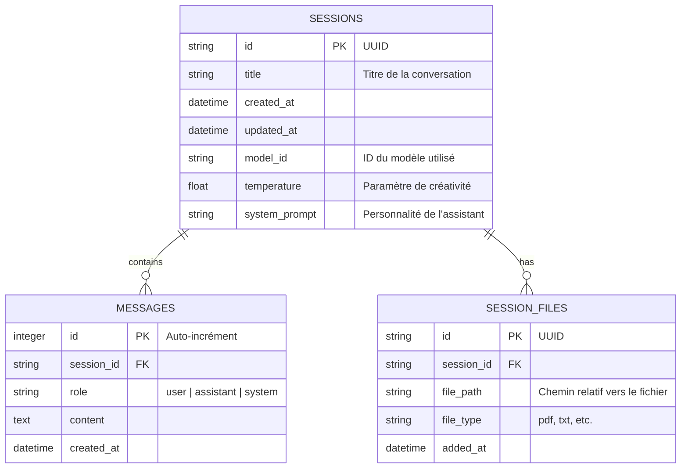

# Plan d'Intégration SQLite pour la Gestion des Sessions

## 1. État des Lieux

L'analyse du code source (`apps/core/src`) a révélé que :

- **Aucune base de données relationnelle** n'est actuellement implémentée.
- La persistance se limite au stockage vectoriel (`LanceDB`) pour le RAG.
- Le `Supervisor` gère les messages de manière éphémère, sans notion d'historique ou de contexte persistant entre les redémarrages.
- Les paramètres (prompt système, modèle) sont codés en dur.

## 2. Objectif

Permettre à l'utilisateur de créer des **sessions autonomes**, chacune possédant :

- Son propre historique de conversation.
- Ses propres paramètres (Température, System Prompt, Modèle sélectionné).
- Ses propres fichiers de contexte (RAG isolé par session).

## 3. Architecture Proposée

### 3.1 Choix Technologique

- **Moteur** : SQLite (léger, fichier unique, parfait pour du local-first).
- **Crate Rust** : `sqlx` (asynchrone, robuste, compatible avec l'écosystème Tokio déjà en place).

### 3.2 Schéma de Base de Données



### 3.3 Structure des Fichiers

Nous allons créer un nouveau module `database` pour encapsuler la logique de persistance.

```
apps/core/src/
├── database/
│   ├── mod.rs          # Point d'entrée et initialisation
│   ├── schema.sql      # Script de création des tables
│   └── sessions.rs     # Opérations CRUD pour les sessions
├── actors/
│   └── ...
├── main.rs             # Initialisation du pool de connexion
```

## 4. Plan d'Implémentation

### Phase 1 : Infrastructure (Mode Code)

1.  Ajouter `sqlx` (avec features `sqlite`, `runtime-tokio`) aux dépendances dans `Cargo.toml`.
2.  Créer le module `database`.
3.  Implémenter l'initialisation de la DB dans `main.rs` (création du fichier `.sqlite` dans `data/db/`).
4.  Exécuter la migration initiale (création des tables).

### Phase 2 : Logique Métier (Mode Code)

1.  Implémenter les fonctions pour :
    - Créer une nouvelle session.
    - Lister les sessions.
    - Ajouter un message à une session.
    - Récupérer l'historique d'une session.
2.  Modifier `SupervisorMessage` pour inclure `session_id`.

### Phase 3 : Intégration (Mode Code)

1.  Mettre à jour le `Supervisor` pour charger l'historique au démarrage d'une session.
2.  Connecter le frontend (Tauri commands) aux nouvelles fonctions de base de données.
