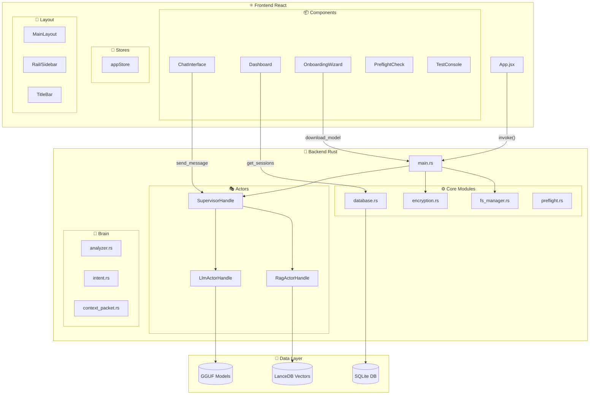
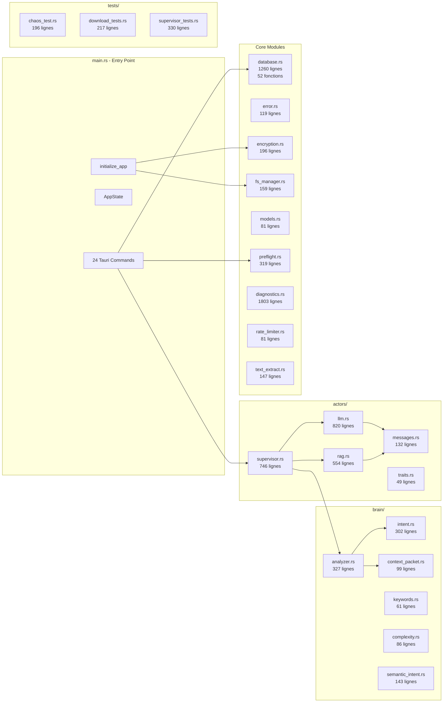
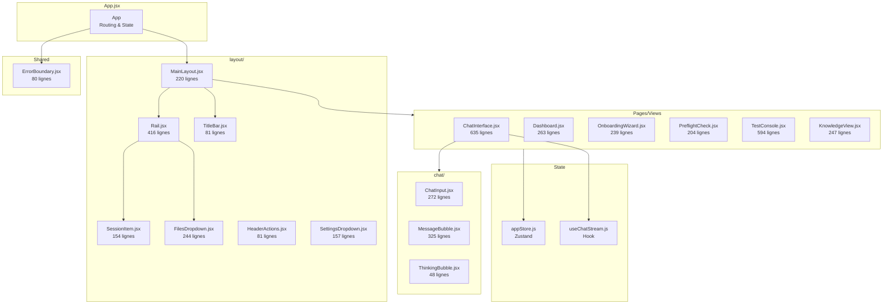
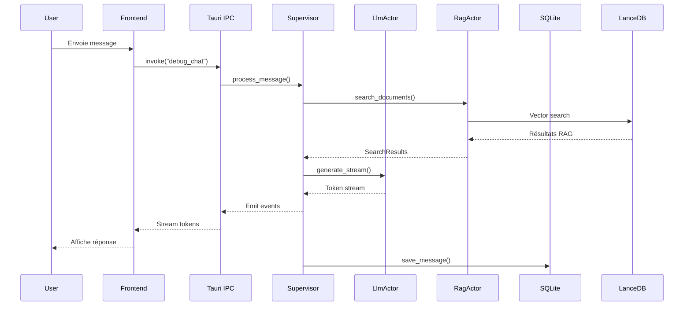

# Carte des Dépendances - WhytChat V1

> Généré automatiquement le 2025-11-28

## 🏗️ Architecture Globale



## 🦀 Modules Backend (Détaillé)



## ⚛️ Composants Frontend (Détaillé)



## 📊 Statistiques Complètes

### Backend Rust

| Métrique | Valeur |
|----------|--------|
| **Fichiers** | 27 |
| **Lignes de code** | 11,848 |
| **Fonctions** | 382 |
| **Structs** | 47 |
| **Enums** | 8 |
| **Implémentations** | ~50 |
| **Tests unitaires** | 125 |

### Frontend React

| Métrique | Valeur |
|----------|--------|
| **Fichiers** | 26 |
| **Lignes de code** | 5,001 |
| **Composants** | ~20 |
| **Hooks personnalisés** | 2 |
| **Stores Zustand** | 1 |

### Total Projet

| Métrique | Valeur |
|----------|--------|
| **Fichiers source** | 53 |
| **Lignes de code totales** | ~16,850 |
| **Ratio Backend/Frontend** | 70% / 30% |

## 🔗 Commandes Tauri (24 commandes)

### Gestion des Sessions
| Commande | Description |
|----------|-------------|
| `initialize_app` | Initialise l'application et les acteurs |
| `create_session` | Crée une nouvelle session de chat |
| `list_sessions` | Liste toutes les sessions |
| `delete_session` | Supprime une session |
| `update_session` | Met à jour le titre/config d'une session |
| `toggle_session_favorite` | Bascule le favori d'une session |
| `get_session_messages` | Récupère les messages d'une session |

### Chat & LLM
| Commande | Description |
|----------|-------------|
| `debug_chat` | Envoie un message et stream la réponse |
| `download_model` | Télécharge le modèle LLM |
| `check_model_exists` | Vérifie si le modèle existe |

### Fichiers & Documents
| Commande | Description |
|----------|-------------|
| `upload_file_for_session` | Upload un fichier pour une session |
| `get_session_files` | Liste les fichiers d'une session |
| `delete_file` | Supprime un fichier |
| `save_generated_file` | Sauvegarde un fichier généré |
| `list_library_files` | Liste les fichiers de la bibliothèque |
| `link_library_file_to_session` | Lie un fichier bibliothèque à une session |
| `reindex_library` | Réindexe la bibliothèque RAG |

### Dossiers
| Commande | Description |
|----------|-------------|
| `create_folder` | Crée un dossier |
| `list_folders` | Liste les dossiers |
| `delete_folder` | Supprime un dossier |
| `move_session_to_folder` | Déplace une session dans un dossier |
| `move_file_to_folder` | Déplace un fichier dans un dossier |

### Diagnostics
| Commande | Description |
|----------|-------------|
| `run_quick_preflight_check` | Vérification rapide du système |
| `run_diagnostic_category` | Exécute une catégorie de tests |

## 📦 Dépendances Externes

### Backend (Cargo.toml)

#### Framework & Runtime
- `tauri` - Framework desktop
- `tokio` - Runtime async
- `async-trait` - Traits async
- `futures` - Primitives async

#### Base de données
- `sqlx` - ORM async SQLite
- `lancedb` - Base vectorielle
- `arrow` - Format columnar

#### IA & ML
- `fastembed` - Embeddings locaux

#### Sécurité
- `aes-gcm` - Chiffrement AES-256
- `rand` - Générateur aléatoire

#### Utilitaires
- `serde` / `serde_json` - Sérialisation
- `chrono` - Date/heure
- `uuid` - Identifiants uniques
- `tracing` - Logging structuré
- `thiserror` - Gestion d'erreurs
- `reqwest` - Client HTTP
- `regex` - Expressions régulières

#### Extraction de texte
- `pdf-extract` - Extraction PDF
- `docx-rs` - Extraction DOCX
- `zip` - Archives ZIP

### Frontend (package.json)

#### Core
- `react` / `react-dom` - Framework UI
- `zustand` - State management

#### UI
- `lucide-react` - Icônes
- `tailwind-merge` - Utilitaires CSS
- `clsx` - Classes conditionnelles
- `react-hot-toast` - Notifications

#### i18n
- `i18next` - Internationalisation
- `react-i18next` - Bindings React
- `i18next-browser-languagedetector` - Détection langue

#### Tauri
- `@tauri-apps/api` - API Tauri
- `@tauri-apps/plugin-shell` - Plugin shell
- `@tauri-apps/plugin-dialog` - Plugin dialogues

## ⚠️ Points d'Attention

### Avertissements Détectés

| Fichier | Issue | Sévérité |
|---------|-------|----------|
| `database.rs` | 54 `unwrap()` (dans tests principalement) | 🟡 Moyen |
| `text_extract.rs` | 6 `unwrap()` | 🟡 Moyen |
| `supervisor.rs` | 11 `unwrap()` | 🟡 Moyen |
| `rag.rs` | 1 bloc `unsafe` | 🟠 À documenter |

### Cohérence Tauri
✅ **Validée** - Toutes les 24 commandes frontend existent dans le backend.

## 🔄 Flux de Données



## 📁 Structure des Fichiers Analysés

### Backend (`apps/core/src/`)

```
src/
├── main.rs                 # Entry point (1532 lignes)
├── database.rs             # SQLite operations (1260 lignes)
├── diagnostics.rs          # Test system (1803 lignes)
├── encryption.rs           # AES-256-GCM (196 lignes)
├── error.rs                # AppError enum (119 lignes)
├── fs_manager.rs           # Path management (159 lignes)
├── models.rs               # Data models (81 lignes)
├── preflight.rs            # System checks (319 lignes)
├── rate_limiter.rs         # Rate limiting (81 lignes)
├── text_extract.rs         # PDF/DOCX extraction (147 lignes)
├── actors/
│   ├── mod.rs              # Module exports
│   ├── supervisor.rs       # Actor orchestrator (746 lignes)
│   ├── llm.rs              # LLM actor (820 lignes)
│   ├── rag.rs              # RAG actor (554 lignes)
│   ├── messages.rs         # Actor messages (132 lignes)
│   └── traits.rs           # Actor traits (49 lignes)
├── brain/
│   ├── mod.rs              # Module exports
│   ├── analyzer.rs         # Message analyzer (327 lignes)
│   ├── intent.rs           # Intent detection (302 lignes)
│   ├── context_packet.rs   # Context structure (99 lignes)
│   ├── keywords.rs         # Keyword extraction (61 lignes)
│   ├── complexity.rs       # Complexity scoring (86 lignes)
│   └── semantic_intent.rs  # Semantic analysis (143 lignes)
└── tests/
    ├── mod.rs              # Test module
    ├── chaos_test.rs       # Resilience tests (196 lignes)
    ├── download_tests.rs   # Download tests (217 lignes)
    └── supervisor_tests.rs # Supervisor tests (330 lignes)
```

### Frontend (`apps/desktop-ui/src/`)

```
src/
├── App.jsx                 # Root component
├── main.jsx                # Entry point
├── i18n.js                 # i18n config
├── components/
│   ├── chat/
│   │   ├── ChatInterface.jsx   # Main chat (635 lignes)
│   │   ├── ChatInput.jsx       # Input component (272 lignes)
│   │   ├── MessageBubble.jsx   # Message display (325 lignes)
│   │   └── ThinkingBubble.jsx  # Loading state (48 lignes)
│   ├── dashboard/
│   │   └── Dashboard.jsx       # Dashboard view (263 lignes)
│   ├── diagnostics/
│   │   ├── TestConsole.jsx     # Test console (594 lignes)
│   │   └── index.js            # Exports
│   ├── layout/
│   │   ├── MainLayout.jsx      # Main layout (220 lignes)
│   │   ├── Rail.jsx            # Sidebar (416 lignes)
│   │   ├── TitleBar.jsx        # Title bar (81 lignes)
│   │   ├── SessionItem.jsx     # Session item (154 lignes)
│   │   ├── FilesDropdown.jsx   # Files menu (244 lignes)
│   │   ├── HeaderActions.jsx   # Header actions (81 lignes)
│   │   └── SettingsDropdown.jsx # Settings (157 lignes)
│   ├── onboarding/
│   │   ├── OnboardingWizard.jsx # Setup wizard (239 lignes)
│   │   └── SessionWizard.jsx   # Session setup (211 lignes)
│   ├── preflight/
│   │   └── PreflightCheck.jsx  # System check (204 lignes)
│   ├── views/
│   │   └── KnowledgeView.jsx   # Knowledge base (247 lignes)
│   └── ErrorBoundary.jsx       # Error boundary (80 lignes)
├── hooks/
│   └── useChatStream.js        # Chat streaming hook
├── lib/
│   ├── logger.js               # Logging utility
│   └── utils.js                # Utility functions
└── store/
    └── appStore.js             # Zustand store
```

---

*Document généré par `scripts/analyze-codebase.ps1`*

