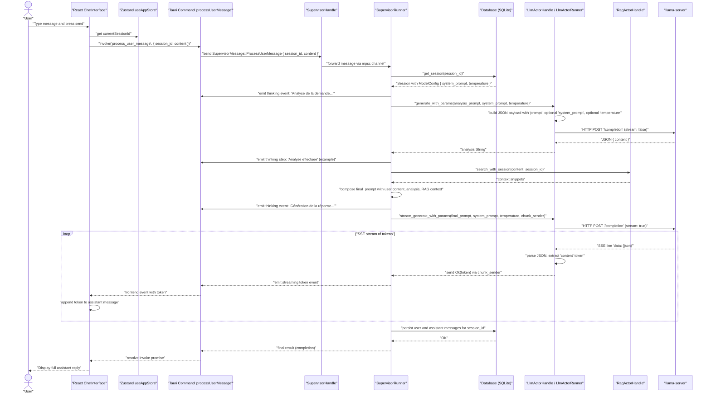

```mermaid
sequenceDiagram
    actor User as "User"
    participant UI as "React ChatInterface"
    participant Store as "Zustand useAppStore"
    participant Tauri as "Tauri Command 'processUserMessage'"
    participant SupHandle as "SupervisorHandle"
    participant SupRunner as "SupervisorRunner"
    participant DB as "Database (SQLite)"
    participant LLM as "LlmActorHandle / LlmActorRunner"
    participant RAG as "RagActorHandle"

    User->>UI: "Type message and press send"
    UI->>Store: "get currentSessionId"
    UI->>Tauri: "invoke('process_user_message', { session_id, content })"

    Tauri->>SupHandle: "send SupervisorMessage::ProcessUserMessage { session_id, content }"
    SupHandle->>SupRunner: "forward message via mpsc channel"

    SupRunner->>DB: "get_session(session_id)"
    DB-->>SupRunner: "Session with ModelConfig { system_prompt, temperature }"

    SupRunner->>Tauri: "emit thinking event: 'Analyse de la demande...'"

    SupRunner->>LLM: "generate_with_params(analysis_prompt, system_prompt, temperature)"
    LLM->>LLM: "build JSON payload with 'prompt', optional 'system_prompt', optional 'temperature'"
    LLM->>"llama-server": "HTTP POST '/completion' (stream: false)"
    "llama-server"-->>LLM: "JSON { content }"
    LLM-->>SupRunner: "analysis String"

    SupRunner->>Tauri: "emit thinking step: 'Analyse effectuée' (example)"

    SupRunner->>RAG: "search_with_session(content, session_id)"
    RAG-->>SupRunner: "context snippets"

    SupRunner->>SupRunner: "compose final_prompt with user content, analysis, RAG context"

    SupRunner->>Tauri: "emit thinking event: 'Génération de la réponse...'"

    SupRunner->>LLM: "stream_generate_with_params(final_prompt, system_prompt, temperature, chunk_sender)"
    LLM->>"llama-server": "HTTP POST '/completion' (stream: true)"
    loop "SSE stream of tokens"
        "llama-server"-->>LLM: "SSE line 'data: {json}'"
        LLM->>LLM: "parse JSON, extract 'content' token"
        LLM-->>SupRunner: "send Ok(token) via chunk_sender"
        SupRunner-->>Tauri: "emit streaming token event"
        Tauri-->>UI: "frontend event with token"
        UI->>UI: "append token to assistant message"
    end

    SupRunner->>DB: "persist user and assistant messages for session_id"
    DB-->>SupRunner: "OK"
    SupRunner-->>Tauri: "final result (completion)"
    Tauri-->>UI: "resolve invoke promise"
    UI-->>User: "Display full assistant reply"
```
